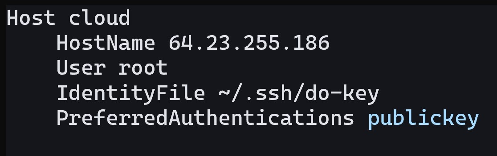

# DigitalOcean Arch Linux Droplet Setup Guide

# Introduction
DigitalOcean is a cloud computing service. It offers you access to remote servers that act like physical computers. For example, a Droplet is a virtual machine that can be quickly deployed. These Droplets are accessed over the internet for hosting and managing websites and applications.

## Overview
This instruction manual is designed for term 2 CIT students, who want to set up a cloud-based server to host and manage websites or applications. The following steps will teach you how to create a Droplet using DigitalOcean's `doctl` command-line tool, configuring it with cloud-init, and connecting to it using SSH keys:
    
1. [Uploading a Custom Image onto DigitalOcean](#uploading-a-custom-image-onto-digitalocean)
2. [Creating a SSH Key Pair](#creating-a-ssh-key-pair)
3. [Installing `doctl`](#installing-doctl)
4. [Adding the Public Key to your DigitalOcean Account](#adding-the-public-key-to-your-digitalocean-account)
5. [Creating an API Token](#creating-an-api-token)
6. [Granting Access to `doctl` using API Token](#granting-access-to-doctl-using-api-token)
7. [Configuring the Cloud-init File](#configuring-the-cloud-init-file)
8. [Deploying the Droplet with Cloud-init](#deploying-the-droplet-with-cloud-init)
9. [Setting Up SSH Config File (Optional)](#setting-up-ssh-config-file-optional)


# Instructions

## Uploading a Custom Image onto DigitalOcean

You will need a custom image like Arch Linux to upload to DigitalOcean. This allows you to create a Droplet with your preferred pre-installed operating system and configurations.

1. Click **manage** on the left-hand side of the menu
<br><br>


2. Select **Backups and Snapshots** from the **Manage** menu
<br><br>


3. Select **Custom Images**


4. Select **Upload Image**


5. Select **Arch Linux Image** and click **Open**


6. Click on **Distribution** and from the drop-down list, select **Arch Linux**


7. Select your closes region and Click **Upload Image**
<br></br>


## Creating a SSH Key Pair
Creating a SSH key pair allows you to securely connect to a remote server. It's more secure than using a password because the keys are much harder to get a hold of. The public key is stored on the server, and the private key stays on your computer, ensuring only you can access the server.

1. Open **Terminal**
2. Type **cd~** to change to root directory 
```
cd ~
```
3. Type **mkdir .ssh** to create a directory called **.ssh**
```
mkdir .ssh
```
4. Type **ls -a** to see if **.ssh directory** exists
```
ls -a
```


5. Type the following command below to create a new **SSH key pair**
```
ssh-keygen -t ed25519 -f ~/.ssh/<key-name> -C "youremail@email.com"
```


6. Change **your-user-name** to your displayed terminal name beside Users, and change and type **“youremail@email.com”** to your desired email address 

7. Change `<key-name>` to what ever you want to name the key file as


## Installing `doctl` 
`doctl` is used to manage DigitalOcean from the command line, making it faster and easier to create and control droplets. This saves time compared to using the web interface.

1. Type the following into the **Terminal** to download **`doctl`**
```
sudo pacman -Syu
```
**`sudo pacman`** **:** A command used to install, update, or manage software packages on Arch Linux-based systems.


> [!NOTE] 
> This command updates the package database and upgrades all installed packages to the latest versions in Arch Linux.


3. Type the following to download `doctl`
```
sudo pacman -S doctl
```


## Creating an API token

1. Click **API** on the left-hand side of the menu on DigitalOcean homepage
<br></br>


2. Click **Generate New Token**
3. Type a **Token Name**, give it **Full Access**, then click **Generate Token**


4. Copy, paste, and save the generated token somewhere safe.

>[!IMPORTANT] 
> Token is only shown once! 

## Granting Access to `doctl` using API Token

1. Type the following command in the terminal to grant `doctl` access to your DigitalOcean account:
```bash
doctl auth init --context personal
```
>[!NOTE] 
> You can change the name to anything after **--context**. I just named it **"personal"**

3. Copy and Paste your token access key into the terminal 


> [!NOTE]
> Make sure there's a blue checkmark beside **Validating token** to confirm it worked 

4. Type the following command to switch context:
```
doctl auth switch --context < Your context name >
```

**Note:** The command switches the current settings in `doctl` to use a different context, letting you switch between different API tokens or configurations.


5. Type the following command to confirm you have successfully authorized `doctl`
```
doctl account get
```


## Adding the Public Key to your DigitalOcean Account

1. Copy and paste the following code into the terminal to add SSH key to DigitalOcean 
```
 doctl compute ssh-key import "your-key-name" --public-key-file ~/.ssh/<key-name>.pub
```

> [!NOTE] 
> Replace `your-key-name` with any name you want the key to be named as 

2. Change `~/.ssh/<key-name>` to where your public key is saved

> [!NOTE] 
> This reads the content of your public key and passes it to the command. Therefore, creating a new SSH key on your DigitalOcean account.

3. Verify key is added by typing the following command:
```
doctl compute ssh-key list
```

>[!NOTE]
> If you see your named key, you have succesfully added your public key to DigitalOcean using `doctl`

## Configuring the Cloud-init File
Cloud-init helps set up a Droplet automatically by using a YAML file. This file tells the server what name to use, what software to install, and what tasks to run, making setup faster and easier without needing to do everything manually. 

1. Type the following comand to install Neovim:
```
sudo pacman -S neovim
```
>[!NOTE] 
> This command downloads Neovim, which is an open-source text editor designed for coding and editing task.

2. Copy and paste the following command to launch and create your .yaml file:
```
nvim <your-cloud-config name>.yaml
```

>[!NOTE]
> Change `<your-cloud-config name>` to what ever you want your .yaml file name to be

4. Press **i** on your keyboard to insert changes to the text file

3. Copy and paste the following into the text-editor:
```
#cloud-config
users:
  - name: example-user
    shell: /bin/bash
    sudo: ['ALL=(ALL) NOPASSWD:ALL']
    ssh_authorized_keys:
      - <your public SSH Key>
disable_root: true
packages:
  - nginx
  - fd
  - less
  - man-db
  - bash-completion
  - neovim
runcmd:
  - 'export PUBLIC_IPV4=$(curl -s http://169.254.169.254/metadata/v1/interfaces/public/0/ipv4/address)'
  - 'echo Droplet: $(hostname), IP Address: $PUBLIC_IPV4 > /var/www/html/index.html'
```
```
Command Explained:
 
`users:` Creates a user with the specified name and configuration.

`name:` example-user:
Sets the username to example-user.

`shell: /bin/bash:`
Specifies the default shell for the user (Bash).

`sudo: ['ALL=(ALL) NOPASSWD:ALL']:`
Gives the user full sudo access without requiring a password.

`ssh_authorized_keys:` Adds your public SSH key for secure login to the droplet without a password.

`disable_root: true:` Disables root login for added security.

`packages:` Installs the listed software packages:

`nginx:` A web server.

`fd:` A faster file search tool.

`less:` A terminal pager for viewing files.

`man-db:` Man page database for command documentation.

`bash-completion:` Adds tab-completion for Bash commands.

`neovim:` A text editor.

`runcmd:` Runs commands after the droplet is created.

`export PUBLIC_IPV4=$(curl...):` Fetches the public IP address of the droplet.

`echo Droplet... >` /var/www/html/index.html: Writes the hostname and public IP to the droplet's web page.
```

5. Change **name** to your actual name
6. Change `<your public SSH Key>` line with your public SSH key
7. Press **`shift + :`** and type **`wq`** to write, quit, and save your .yaml text file


## Deploying the Droplet with Cloud-init
1. Type the following command in your terminal to view your list of ssh keys. Then locate your key **ID** on the left side:
```
doctl compute ssh-key list
```
>[!IMPORTANT]
> Remember or note your **ID** somewhere for the next step

2. Copy and paste the following into the **Terminal**:
```
doctl compute droplet create --image 165064169 --size s-1vcpu-1gb --region sfo3 --ssh-keys < git-user > --user-data-file < path-to-your-cloud-init-yaml-file > --wait first-droplet 
```
> [!NOTE] 
> Use the following command to find Arch Linux image ID:

```
doctl compute image list
```

>[!CAUTION] 
> Adding another name beside **--wait first-droplet** will create a "second-droplet"


3. Replace **< git-user >** with your **ID** number from step 1

4. Replace **< path-to-your-cloud-init-yaml-file >** to the path location of your **cloud-config.yaml** file


5. Press **enter**

> [!NOTE] 
> May take a minute. If the output looks like the picture above, you have succesfully deployed your Droplets


6. Type the following command to verify it worked:
```
ssh -i < /path/to/private-key > root@your-droplet-ip
```
7. Change **< /path/to/private-key >** to where your private key is and **username** as your user

8. Change **"your-droplet-ip"** to the IP address of the droplet you want to connect. 

> [!NOTE] 
> Can find your IP by typing the following command:
```
doctl compute droplet list
```

9. Press **enter** 


>[!NOTE] 
> You have succesfully connected to your droplet if your terminal prompts `[root@first-droplet:~]$`

Congratulations! You just learned how to install and configure `doctl` in an existing droplet. Then used it to create a new droplet.

## Setting Up SSH Config File (Optional)
1. In your terminal, type the following command in your Arch droplet:
```
nvim .ssh/config
```

2. Press **i** on your keyboard to start inserting text

3. Copy and paste the following text into the text editor:
```
Host <name for connecting>
    HostName <droplet IP Address>
    User root
    IdentityFile ~\.ssh\<private key>
    PreferredAuthentications publickey
```

**Note:** Type a host name for connecting, paste your host name droplet IP address, and type the name of your private key

4. Press **`shift + :`** and type **`wq`** to write, quit, and save your text file in .ssh
5. Connect to your droplet by typing the following:
```
ssh `<Host name for connecting>`
```
6. Change `<Host name for connecting>` to your config host name and press **enter**


# References

*How to automate droplet setup with cloud-init*.    DigitalOcean . (2022). 
  https://docs.digitalocean.com/products/droplets/how-to/automate-setup-with-cloud-init/ 

*How to create a personal access token*. DigitalOcean . (2024). 
  https://docs.digitalocean.com/reference/api/create-personal-access-token/ 

*How to install and configure doctl*. DigitalOcean . (2020). 
  https://docs.digitalocean.com/reference/doctl/how-to/install/ 

McNinch, N. (2024). *Week 2 ACIT 2420: Create an SSH key pair to authenticate and connect to a DigitalOcean droplet*. 
  [Lecture Notes]. BCIT. https://gitlab.com/cit2420/2420-notes-f24/-/blob/main/2420-notes/week-two.md


